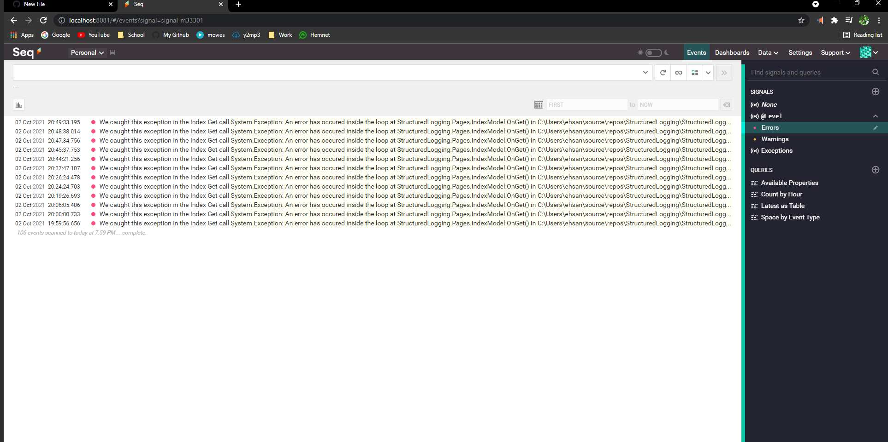

# StructuredLoggin
Structured logging in Asp.net core with Seq and Serilog. 

# Benefits of structur logging with Serilog and Seq
* You get a nice overview of what is happening during the run time of application 
* With seq you can filter and search 
* You can easily find the error 

# Packages
* Serilog.AspNetCore
* Serilog.Enrichers.Envirement
* Serilog.Enrichers.Process
* Serilog.Enrichers.Thread
* Serilog.Settings.Configuration
* Serilog.Sink.Seq

# Tools
* Visual Studio
* Docker Desktop

I have used Docker to use Seq image and see my logs in the browser live.\
Docker command to use Seq cont
* Command: docker run -d --restart unless-stopped --name seq -e ACCEPT_EULA=Y -v C:\Users\ehsan\source\repos\StructuredLogging\Logs:/data -p 8081:80 datalust/seq:latest
It will pull an docker image from datalust/seq:latest and will run my docker container in the background untill i explicitly stop the container. \
* Access at: http://localhost:8081 \

